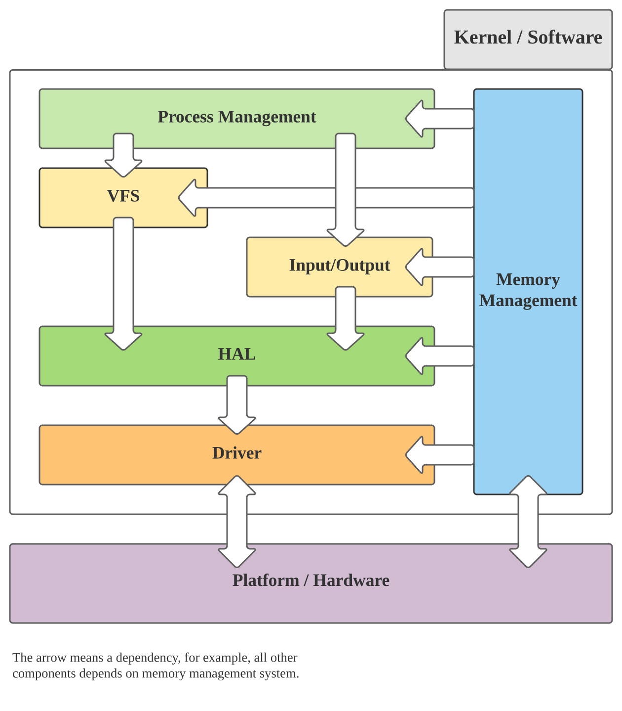
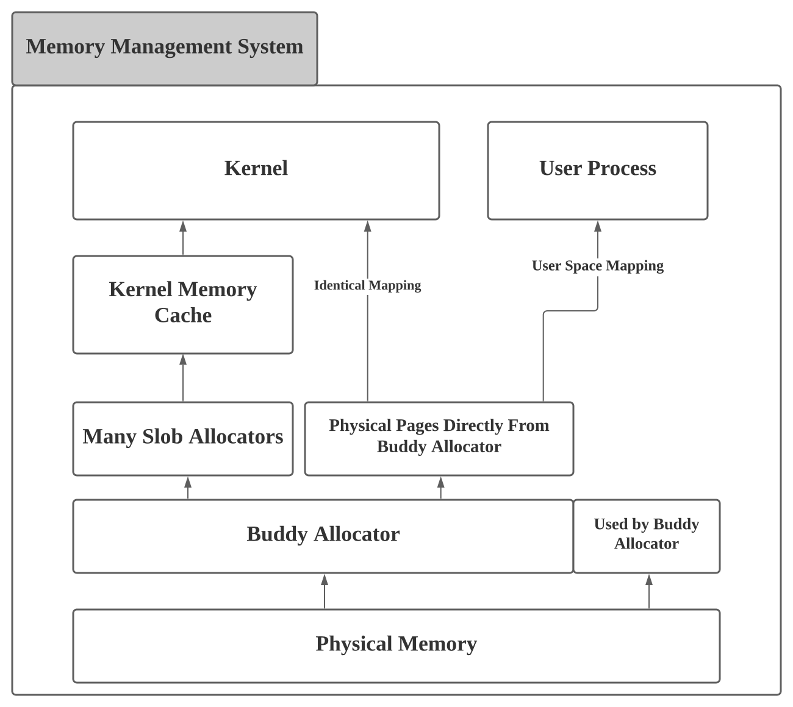
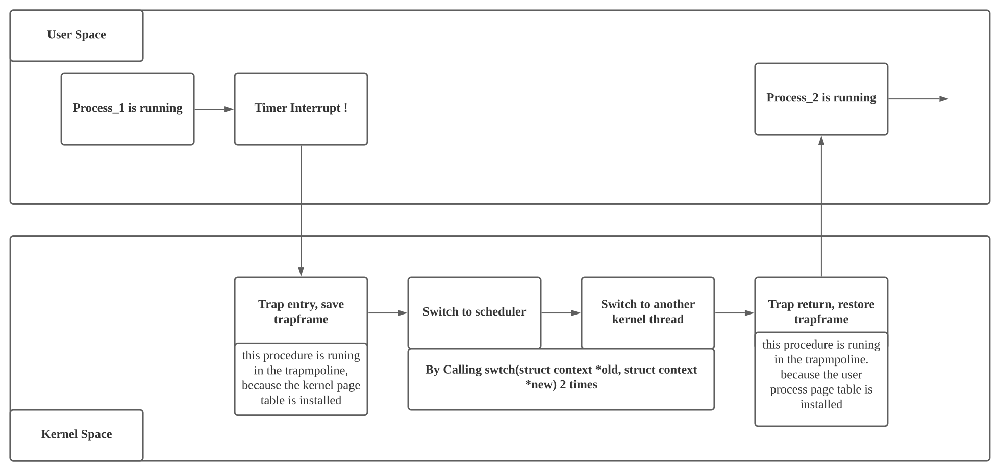
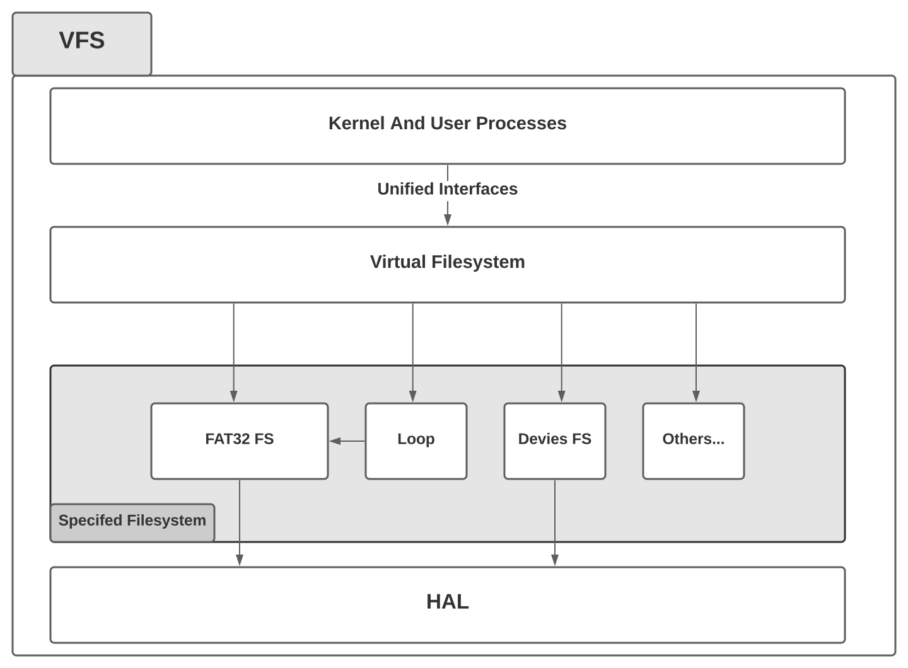

# ZGMOS Documentation 

---

# Ch.1 概述

## 1.1 项目综述

ZGMOS项目是全国大学生计算机系统能力大赛，操作系统赛，内核赛道的参赛作品。本项目目前**从零**实现了一个简单的，xv6风格的宏内核，目前可以在QEMU以及K210平台上运行。

## 1.2 内核实现框架以及模块

内核主要分为如下四个模块：

1. 内存管理
2. 进程管理
3. 文件系统
4. 硬件虚拟层和驱动

系统架构图如下：



### 1.2.1 内存管理

在ZGMOS中，内存管理部分我们主要使用了一个伙伴分配器（Buddy Allocator）和一个简易的，类似于Slob的较小粒度的内存分配器(下面以slob来指代），以及一个内核内存缓冲模块来对slob对象进行统一管理。伙伴系统的最小分配粒度是一个最小页的大小,为4KiB，而slob的分配粒度最小是16Bytes。内存管理是在整个系统中最早进行初始化的模块，其他所有模块都依赖于内存管理模块。

### 1.2.2 进程管理

在ZGMOS中，进程管理部分我们主要实现了系统的多进程功能，能够从标准的ELF文件中读入可执行文件，装入内存中并进入用户态进行运行，并通过时钟中断来进行抢占。Context Switch的风格与xv6类似，内核和用户进程分别拥有一个中断Handler,通过一个跳板页面来从用户态进入内核态，并在内核态里面进行上下文切换，一般是切换到调度器进程，并由调度器选择下一个进程进行运行。目前，我们只实现了一个简单的轮转式的调度器，不过预留了相关接口。所有进程的实体（struct task_struct），根据其进程状态不同，分别通过几个链表进行相连，调度器的任务就是从某个链表中取出一个进程实体，取出的实体会被运行。

### 1.2.3 文件系统

在ZGMOS中，文件系统分为了两层，下层是具体的，面向具体数据存储结构与组织方式的文件系统，例如本次比赛指定的FAT32，亦或者是一个设备文件系统、一个loop文件等等。上层是一个虚拟文件系统（VFS），VFS将对具体的文件系统的操作进行封装与抽象，对用户进程提供服务，将用户进程的请求代理给下层的文件系统。

### 1.2.4 硬件虚拟层和驱动

由于本次比赛要在两个平台上进行开发，我们就设计了一个硬件虚拟层（HAL）用来封装平台上的硬件差异，方面后续的开发。主要设计两个抽象硬件，一个是UART，另一个是存储设备。对于存储设备，在K210平台，存储设备是SPI接口的存储卡，而在QEMU上，存储设备是Virtio Block设备，而我们的下层文件系统只会依赖于虚拟的硬件，屏蔽了硬件差异，类似于设计模式中的Adapter模式。

## 1.3 项目进度
基本的内核框架已经完成，除去驱动部分，github commits记录的代码行数达到了13000+，但目前实现的系统调用数目有限，仅能通过个别测试用例，目前剩余的工作主要是实现系统调用。

---

# Ch2. 内存管理

内存管理系统的架构图：




## 2.1 伙伴系统 Buddy Allocator

伙伴系统，或者叫做伙伴分配器，是一个常用的物理内存分配算法。在ZGMOS中，伙伴系统是最底层的内存分配设施，负责对物理内存进行分配。简易Slob也依赖于伙伴系统。本项目的实现方法是使用了多个以数组表示的完全二叉树(因为真实的物理内存页数并不是二次幂，所以是多个完全二叉树），在稳定性上，本项目实现的伙伴分配器通过了压力测试，没有出现问题，在速度上，实现中没有任何递归（在内核中最好不要有递归），分配和释放的时间复杂度都是`O(logN)`，N为物理内存的页数。

伙伴系统的分配调用`buddy_alloc()`会被`pmem_alloc()`封装。在这里，我们增加了一个抽象层，目的是为了维护需要，如果需要更换物理内存分配器，只需要修改`pmem_alloc()`系列函数即可。

具体实现：
> kernel/buddy.c kernel/buddy.h

## 2.2 Slob Allocator

简易Slob是在ZGMOS中，我们实现的一个小细粒度内存分配器，该分配器从伙伴系统中取得页，并将这些页切割，分成更小的内存块进行分配，每个内存块的大小可以从16字节到2048字节，大于2048字节的内存块应该直接使用伙伴系统进行分配。

每个slob对象在初始化的时候，都会被被指定一个特定的分配大小，slob只可以分配该大小的内存空间。所以需要多个slob来进行分配。对于内核中经常被使用到的对象的大小，我们应该指定给一个slob分配器。除此之外，我们还需要一个slob的管理设施来对slob进行管理，这就引出了内核内存缓存。

具体实现：
> kernel/slab.c kernel/slab.h

## 2.3 内核内存缓存 Kernel Memory Cache

内核内存缓存是用来管理slob的设施，所有slob对象是从一个静态的slob对象那里分配得到的。而这些真正用于内核对象的slob对象被挂在一个链表上， 内核内存缓存对内核中的其他模块暴露一个`kmem_alloc()`的接口，而这个接口又被`kmalloc()`封装 。

内核中的其他模块间接调用`kmem_alloc()`时，内存内核缓存就会根据大小匹配合适的slob对象，并从这个slob对象中取得相应的内存块。如果发现当前的slob没有符合条件的，那就重新申请一个slob，并进行分配。

内核中的其他模块间接调用`kmem_free()`时，内存内核缓存根据标记直接选择相应的slob对象，将内存归还,归还的内存只会放到slob中，除非调用了`kmem_shrink()`，空闲内存不会被释放给伙伴系统。目前，由于时间关系，我们还没有在这个地方实现真正的内存缓存以及每个核心独立占有的内核对象缓存。

与物理内存分配器的设计思路相同，我们在这个地方进行一个封装的原因也是为了解耦，如果我们实现了更好的内存分配器，我们可以通过这个抽象层，很简单的进行切换。

具体实现：
> kernel/kmem.c kernel/kmem.h

---

# Ch3. 进程管理

## 3.1 进程的调度

ZGMOS实现的进程上下文切换的方法与xv6较为类似，切换只可能发生在内核态，每次切换需要重新进入调度器进程，让调度器来选择下一个运行的进程。



相关实现：
> kernel/process.c kernel/scheduler.c 

## 3.2 进程的创建与销毁

目前ZGMOS使用`task_create()`函数调用来从一个标准ELF文件中构建用户程序所需要的内存映像以及相关的内核数据结构，并将`trapframe`中的`kernel_epc`设置为程序运行的起始地址。在该进程被调度器调度时，内核态的中断返回指令`sret`将`spec`加载到`PC`，整个系统进入用户态，运行用户进程。

相关实现：
>kernel/process.c kernel/scheduler.c kernel/uvec.c kernel/uvec_asm.s


## 3.3 系统调用的实现

当用户程序执行了`ecall`指令后，CPU陷入到中断处理函数中，用户的中断处理函数是`uvec_asm`，是写在汇编文件中，放在一个跳板页面里面，目的是为了切换页表。该函数将用户态的通用寄存器状态进行保存，放入到`trapframe`中，随后的真正的处理函数可以根据`trapframe`中的寄存器数据来判断调用了哪个系统调用，然后进行相应的处理。系统调用的返回值会放入到`trapframe`中，在用户中断返回时，返回值会被放入到`a0`寄存器，这样就完成了一次系统调用。

相关实现：
> kernel/uvec.c, kernel/uvec_asm.s, kernel/syscall.c

---

# Ch4. 文件系统

文件系统的设计采用了一种适配器模式，具体文件系统将各种操作暴露给虚拟文件系统，而这些操作都是事先指定好的。如果具体文件系统实现了这些操作中的一部分，那么就可以挂载到虚拟文件系统当中。



## 4.1 具体文件系统

目前ZGMOS实现的典型具体文件系统有一个，就是FAT32文件系统，支持FAT32文件的相关操作。除此之外ZGMOS还实现了一个简单的设备文件系统，支持用户进程将数据写入到串口之中。FAT32文件系统的相关内容在本文档中就不赘述了。

具体实现：
> kernel/fat32.c kernel/fat32.h

## 4.2 虚拟文件系统 VFS

虚拟文件系统的作用是统一整个用户操作接口，整个系统所有的、与文件系统相关的操作，都会通过VFS的代理。内核的其他部分和用户进程不必考虑具体操作的文件系统，虚拟文件系统将各种操作代理给后端的具体文件系统。同时自行配备了一个以页大小为粒度的缓冲设施，主要是为了系统速度考量，减少IO调用的次数。

每个文件对象（包括文件，目录，设备文件，或是一个挂载点等等），在VFS中被表述成了一个`vnode`，在程序中的实体是`struct vnode`，由于时间仓促（没时间实现一个红黑树）而且具体文件系统使用的是FAT32文件系统，没办法直接在文件系统中存储`inode`号，所以我们没有采用那种类似于`inode`的索引方式（以一个数字进行索引），我们采用的是具体的目录结构，采用路径进行索引，每个`vnode`都会支持一定的操作，对于文件类型的`vnode`我们可以对其进行读写，对一个目录类型的`vnode`我们可以对其进行`iterate`操作，来遍历其中的内容。

具体实现：
> kernel/vfs.c kernel/vfs.h

## 4.3 文件系统前后端的连接

具体的文件系统通过实现如下的一个借口来为VFS提供服务：

```c
// vfs.h
struct vfs_backend {
  // all the functions below return int as error code
  // 0 for success, other for failures.

  struct list_head list;

  // lower file system or specifed file system
  void *lfs;
  uint64_t lfs_obj_size;

  //  get root object
  int (*root)(void *lfs, void *lobj);

  // create a file, return error code
  int (*create)(void *lfs, void *p_lobj, char *name);

  // delete the file
  int (*unlink)(void *lfs, void *lobj);
  
  // flush the whole fs
  int (*flush)(void *lfs);

  // make a dir
  int (*mkdir)(void *lfs, void *p_lobj, char *name);

  // remove a dir
  int (*rmdir)(void *lfs, void *p_lobj, void *lobj);

  // read from file
  uint64_t (*read)(void *lfs, void *lobj, uint64_t offset, void *buf, uint64_t buf_len);

  // write to file
  uint64_t (*write)(void *lfs, void *lobj, uint64_t offset, void *buf, uint64_t buf_len);

  int (*trunate)(void *lfs, void *lobj, uint64_t new_sz);
  int (*enlarge)(void *lfs, void *lobj, uint64_t new_sz);

  // get file size
  uint64_t (*size)(void *lfs, void *lobj);

  // get file name
  char *(*name)(void *lfs, void *lobj);

  // get file type
  uint32_t (*type)(void *fs, void *lobj);
  
  // iterate through directories
  // while the iterate , this function will fill the memory to which the obj points
  void *(*iterate)(void *lfs, void *dir_obj, void *iter_obj, void *lobj);

  // end the iterate, release the resources
  void (*end_iterate)(void *lfs, void *iter_obj);

  void (*lock)(void *lfs);
  void (*unlock)(void *lfs);
};


```
具体的文件系统只需要实现上述的一部分操作，即可挂载到VFS当中。

## 4.4 虚拟文件系统缓冲 VFS Buffer

我们在虚拟文件系统中实现了一个以页大小为粒度的缓冲设施。基本设计是采用了一个页缓冲池，当有文件被使用时，一个页会绑定到一个文件的某个位置上，对文件的读写就简化成了对内存的操作，大大增加了系统的运行速度。当然，缓冲池的大小是有限的，我们采用LRU算法来进行页面置换，在具体的实现上，我们使用了一个链表结构来实现LRU。如果用户进程再次打开了一个没有缓冲的文件而且VFS从伙伴系统那里分配到的内存已经用光了，那么就要对之前最近没有被使用过的页进行解绑定操作并进行一次或者多次IO操作，将某个文件内容的更新写入到后端的具体文件系统上，该页面就可以用来为新的文件进行缓冲。

VFS的缓冲也可以关闭，让后端的具体文件系统来管理系统的缓冲。

未来ZGMOS应该实现一个完整的，独立于文件系统的缓冲设施，方便同意管理同时可以实现系统内存的swaping。

具体实现：
> kernel/vfs.c kernel/vfs.h

---

# Ch5. 硬件虚拟层和驱动

这一章的相关源代码均放在`hal`文件夹中。

## 5.1 硬件虚拟层，HAL

### 5.1.1 UART
串口的硬件虚拟层非常简单，只需要在 `uart_hal.c` 文件中实现相关的操作，通过条件编译来达到对于不同的硬件平台，进行不同的操作的目的。

```c
#ifndef __UART_HAL_H_
#define __UART_HAL_H_

void uart_hal_init();
void uart_hal_send(char ch);
char uart_hal_recv();

#endif // __UART_HAL_H_
```

## 5.1.2 Disk

硬盘IO的操作同样非常简单。

```c
#ifndef __DISK_HAL_H_
#define __DISK_HAL_H_

#include <stdint.h>
#include <stdbool.h>

struct disk_hal;

typedef bool(*disk_hal_read_func)(struct disk_hal *params, uint64_t sector, void *buf);
typedef bool(*disk_hal_write_func)(struct disk_hal *params, uint64_t sector, void *buf);

struct disk_hal_ops {
  disk_hal_read_func read_op;
  disk_hal_write_func write_op;
};

struct disk_hal {
  void *dev;
  uint64_t len;
  struct disk_hal_ops ops;
};

struct disk_hal *disk_hal_init();
bool disk_hal_read(struct disk_hal *disk, uint64_t sector, void *buf);
bool disk_hal_write(struct disk_hal *disk, uint64_t sector, void *buf);
bool disk_hal_destory(struct disk_hal *disk);
#endif // __DISK_HAL_H_
```

## 5.2 硬件驱动

### 5.2.1 QEMU Virt 平台

主要实现了两个设备驱动，这两个设备分别是`NS16550`和`Virtio Block device`。相比于原版的`xv6`系统，我们本次实现的`Virtio Block`驱动采用了非Legacy接口，算是一个改进之处。

### 5.2.2 K210 平台

K210平台的驱动主要移植于Kendryte的官方SDK与`xv6-k210`项目。在此感谢`xv6-k210`的开发者，他们的工作给了我们巨大的帮助。


---

# Ch6. 基础设施

在该章节，我们将介绍在ZGMOS中所用到的一些基础的数据结构和函数，以及在开发过程中的Debug技巧。

## 6.1 "kustd" : Kernel Macro 'std' Library

一些非常基本的库函数的实现，类似于`memcpy()`之类的经常被用到的库函数。

## 6.2 Utils

一些没有在标准库中，但是却很有用的内容。例如一些用来进行对齐的宏。
```c
// utils.h
#define POWER_OF_2(p) (((uint64_t)1 << (p)))

// n is number of '1' in binary number
// ALL_ONE_MASK(12) = POWER_OF_2(12) - 1
//                  = 4096 - 1
//                  = 4095 = 1111_1111_1111b
#define ALL_ONE_MASK(n) ( POWER_OF_2(n) - 1 )

#define ALIGN_XBITS(a, n) ( ((uint64_t)(a)) & ( ~ALL_ONE_MASK(n) ) )

#define ALIGN_4K(a) (ALIGN_XBITS(a, 12))
#define ALIGN_2M(a) (ALIGN_XBITS(a, 21))
#define ALIGN_1G(a) (ALIGN_XBITS(a, 30))
```

## 6.3 一些常用的内核数据结构

1. `struct list_head`，Linux内核中经典的循环双链表实现。

2. `struct bitmap`，简单的位图实现，可以用来分配文件描述符FD和进程号PID

## 6.4 RISC-V 页表操作

操作页表是内核必须实现的功能，所以我们实现了一系列页表操作函数，附带一个简单的单元测试（单元测试没有体现在下面的内容中）

```c
// pte.h

// PTE library only operates on the bits in pte_t(uint64_t)
// Simply say, It can run on any platfrom, it only access memory
// Surely, only on RISC-V, it is not meaningless

// page size enum
enum {
  PTE_PAGE_4K,
  PTE_PAGE_2M,
  PTE_PAGE_1G
};

#define VA_VPN(va)  ( ((uint64_t)(va) >> 12) & ALL_ONE_MASK(27))
#define VA_VPN2(va) ( ((uint64_t)(va) >> 30) & ALL_ONE_MASK(9))
#define VA_VPN1(va) ( ((uint64_t)(va) >> 21) & ALL_ONE_MASK(9))
#define VA_VPN0(va) ( ((uint64_t)(va) >> 12) & ALL_ONE_MASK(9))

#define PA_PPN(va)  ( ((uint64_t)(pa) >> 12) & ALL_ONE_MASK(44))
#define PA_PPN2(va) ( ((uint64_t)(pa) >> 30) & ALL_ONE_MASK(9))
#define PA_PPN1(va) ( ((uint64_t)(pa) >> 21) & ALL_ONE_MASK(9))
#define PA_PPN0(va) ( ((uint64_t)(pa) >> 12) & ALL_ONE_MASK(9))

// pte_t is just a uint64_t, pretty simple
pte_t *pte_create();

// Do not remap or cause any address overlap, or you will run into trouble
// flags could be :
// PTE_X_SET, PTE_R_SET, PTE_W_SET, PTE_V_SET, PTE_U_SET and their 'or' combination
// page_size is the enum below
void pte_map(pte_t *p, void *va, void *pa, uint64_t flags, int page_size);

// length is in bytes
void pte_range_map(pte_t *p, void *va, void *pa, uint64_t flags, uint64_t length);

// auto select the page size
// alignment is not check insied the function
void pte_unmap(pte_t *p, void *va);

void pte_range_unmap(pte_t *p, void *va, int64_t length);

// flags, and page_size will be written in this function if not NULL
void *pte_walk(pte_t *p, void *va, uint64_t *flags, int *page_size);
```

## 6.5 OpenOCD or QEMU + GDB 的调试设施

我们使用了GDB可以加载Python脚本的特性，将各种GDB调试时的操作进行简化，去除了很多没有必要的重复工作。

```python
# scripts/gdbinit.py
import gdb

def main():
    gdb.execute('target extended-remote localhost:3008')
    gdb.execute('b _debug_stub')
    gdb.execute('b main')
    gdb.execute('c')
    gdb.execute('layout split')

if __name__ == "__main__":
    main()
```

我们还使用了一些条件编译的trick，在Linker Script里面做手脚，实现了让K210平台启动时在内核入口处进行空转（QEMU平台则不受影响，因为QEMU的GDB Stub可以直接被Halt），方便JTAG调试器及时地在内核运行前Halt住CPU。

---

# Ch7. 开发中遇到的Bug与难题

## 7.1 Linker Script
当我们在使用 MEMROY 命令时，各个段不能直接进行4K对其，否则除了程序段，剩下的所有段都会被链接器放入到`.bss`段中。我曾在多个论坛求助，但最终没能得到解答，目前该问题还是没有得到解决。具体可以参见以下链接(需要梯子)：

[Reddit Thread : A question about linker script: when sections paged aligned, data and rodata both are put into bss...](https://www.reddit.com/r/osdev/comments/n7loq6/a_question_about_linker_script_when_sections/)

如果抛去前提，不使用MEMORY命令，那么4K对其就是很简单的事情了。但是这个问题根本上是没有得到解决的。

## 7.2 SPI与DMA的驱动问题

由于K210的文档不全而且我们对于这些硬件内容也不太熟悉，所以直接使用了`xv6-k210`项目的驱动，我们希望可以尝试自己移植官方SDK的驱动过来，但是有点困难。

---

# Ch8. 项目总结

ZGMOS项目的开发时间大概为一个月。由于项目进度管理出现了一些问题，ZGMOS目前能运行通过的系统调用还很少，处在一个需要增加系统调用的阶段。

不过，重要的是我们在开发过程中学到了很多。在开发之前我们对于`xv6`还不甚熟悉，对于Linux仅限于使用，但是现在我们对于`xv6`的整体架构有了非常清晰的认识和理解，学习了Linux中的一部分优秀设计。在整个开发的过程中学到了非常多的内容，上到对于操作系统本质的认识，下到对ELF格式的理解。对于进程的上下文切换过程不再云里雾里，理解了为什么每个进程都有一个内核栈，认识到文件系统在某种层面上来说是一种数据组织形式。

不管能不能通过初赛，本项目都会继续进行开发，计划未来使用Rust进行重写。

ZGMOS, A simple toy Kernel in FOUR WEEKS~

*2021/5/31*
